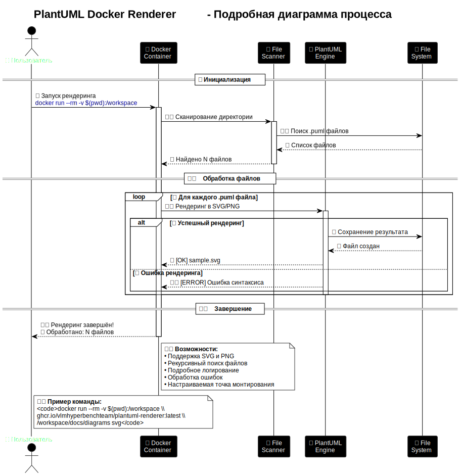

# PlantUML Docker Renderer

[](https://plantuml.com/)
[](https://www.docker.com/)
[](https://github.com/VLMHyperBenchTeam/VLMHyperBench)

Docker образ для автоматического рендеринга PlantUML диаграмм в SVG и PNG форматы.

## Структура документации

Документация проекта организована следующим образом:
- `README.md` — основная информация о проекте, быстрый старт и основные функции
- `docs/` — папка с подробной документацией
  - `docs/ghcr-authentication-windows.md` — решение проблемы аутентификации с GitHub Container Registry на Windows
- `examples/` — примеры использования и тестовые диаграммы
  - `examples/examples-usage.md` — руководство по использованию примеров

## Описание

Docker образ `ghcr.io/vlmhyperbenchteam/plantuml-renderer` основан на официальном образе [plantuml/plantuml](https://hub.docker.com/r/plantuml/plantuml) и предназначен для пакетного рендеринга всех PlantUML файлов (`.puml`) в указанной директории.

## Быстрый старт

### Аутентификация с GitHub Container Registry

Перед использованием образа из GitHub Container Registry необходимо пройти аутентификацию. Вы можете использовать GitHub CLI или Docker CLI:

**Использование GitHub CLI (рекомендуется):**
```bash
gh auth login
```

**Использование Docker CLI:**
```bash
echo YOUR_GITHUB_PERSONAL_ACCESS_TOKEN | docker login ghcr.io -u YOUR_GITHUB_USERNAME --password-stdin
```

### Запуск рендерера

#### Linux

```bash
# Установить точку монтирования
export MOUNT_POINT="/workspace"

# Рендеринг всех .puml файлов в SVG
docker run --rm -v $(pwd):$MOUNT_POINT ghcr.io/vlmhyperbenchteam/plantuml-renderer:latest $MOUNT_POINT/docs/architecture/diagrams svg

# Рендеринг всех .puml файлов в PNG
docker run --rm -v $(pwd):$MOUNT_POINT ghcr.io/vlmhyperbenchteam/plantuml-renderer:latest $MOUNT_POINT/docs/architecture/diagrams png
```

#### Windows

```powershell
# Установить точку монтирования
$env:MOUNT_POINT="/workspace"

# Рендеринг всех .puml файлов в SVG
docker run --rm -v ${PWD}:$env:MOUNT_POINT ghcr.io/vlmhyperbenchteam/plantuml-renderer:latest $env:MOUNT_POINT/docs/architecture/diagrams svg

# Рендеринг всех .puml файлов в PNG
docker run --rm -v ${PWD}:$env:MOUNT_POINT ghcr.io/vlmhyperbenchteam/plantuml-renderer:latest $env:MOUNT_POINT/docs/architecture/diagrams png
```

## Как работает PlantUML Docker Renderer

Ниже приведены две диаграммы, которые иллюстрируют работу `plantuml-renderer` на разных уровнях детализации.

### Базовый процесс


_На этой диаграмме показан основной поток работы:_
- Пользователь запускает контейнер с помощью Docker.
- Контейнер находит и обрабатывает все `.puml` файлы в указанной директории.
- Результаты рендеринга (SVG/PNG) возвращаются пользователю.

[Исходник диаграммы](examples/process_simple.puml)

---

### Детализированный процесс



_Здесь показан полный жизненный цикл `plantuml-renderer`:_
- Инициализация и запуск контейнера.
- Сканирование директорий и поиск `.puml` файлов.
- Для каждого файла — рендеринг, обработка ошибок, логирование, сохранение результата.
- Завершение работы и возврат результатов пользователю.
- В диаграмме отражены все ключевые этапы, включая обработку ошибок и логирование.

[Исходник диаграммы](examples/process_detailed.puml)

---

> **Примечание:**
> Эти диаграммы были сгенерированы самим `PlantUML Docker Renderer`.
> Вы можете прочитать, как получить такие же в [examples/examples-usage.md](examples/examples-usage.md).

## Структура образа

### Основные компоненты

- **Базовый образ**: `plantuml/plantuml:latest`
- **Дополнительные пакеты**: bash, findutils, grep, python3
- **Скрипт рендеринга**: `/usr/local/bin/render_plantuml.py`

### Алгоритм работы

1. Проверка наличия аргументов с путем к папке и форматом
2. Валидация существования указанной директории
3. Поиск всех файлов с расширением `.puml`
4. Последовательный рендеринг каждого файла в указанный формат
5. Проверка успешности создания файлов
6. Вывод результатов обработки

## Возможности

### Поддерживаемые форматы

- **Входные файлы**: `.puml` (PlantUML)
- **Выходные файлы**: `.svg` (Scalable Vector Graphics), `.png` (Portable Network Graphics)

### Особенности

- **Автоматический поиск**: Находит все `.puml` файлы в указанной директории
- **Сохранение структуры**: Файлы создаются в тех же папках, что и исходные `.puml` файлы
- **Обработка ошибок**: Выводит информацию об успешных и неудачных операциях
- **Настраиваемая точка монтирования**: Поддерживает переменную окружения `MOUNT_POINT`
- **Безопасность**: Использует официальный PlantUML образ

## Устранение неполадок

### Частые проблемы

#### 1. Ошибка "Директория не существует"

```bash
# Убедитесь, что путь указан правильно
docker run --rm -v $(pwd):/workspace ghcr.io/vlmhyperbenchteam/plantuml-renderer:latest /workspace/correct/path/to/diagrams svg
```

#### 2. Файлы не рендерятся

```bash
# Проверьте синтаксис PlantUML файлов
# Убедитесь, что файлы имеют расширение .puml
```

#### 3. Проблемы с правами доступа

```bash
# Запустите с правами текущего пользователя
docker run --rm -v $(pwd):/workspace -u $(id -u):$(id -g) ghcr.io/vlmhyperbenchteam/plantuml-renderer:latest /workspace/docs/architecture/diagrams svg
```

### Отладка

```bash
# Запуск в интерактивном режиме
docker run --rm -it -v $(pwd):/workspace ghcr.io/vlmhyperbenchteam/plantuml-renderer:latest /bin/bash

# Проверка содержимого скрипта
cat /usr/local/bin/render_plantuml.py
```

## Локальная сборка

Если вы хотите собрать образ локально:

```bash
# Клонировать репозиторий
git clone https://github.com/VLMHyperBenchTeam/plantuml-docker-renderer.git
cd plantuml-docker-renderer

# Собрать образ
docker build -t plantuml-renderer .

# Использовать локальный образ
export MOUNT_POINT="/workspace"
docker run --rm -v $(pwd):$MOUNT_POINT plantuml-renderer $MOUNT_POINT/docs/architecture/diagrams svg
```

## Ссылки

- [Официальный PlantUML Docker образ](https://hub.docker.com/r/plantuml/plantuml)
- [PlantUML документация](https://plantuml.com/)
- [PlantUML синтаксис](https://plantuml.com/guide)
- [SVG формат](https://www.w3.org/Graphics/SVG/)
- [PNG формат](https://www.w3.org/Graphics/PNG/)

## Лицензия

Данный образ использует официальный PlantUML образ, который распространяется под лицензией GPL v3.

### Лицензионные аспекты использования

**Важно:** Использование этого Docker образа как инструмента НЕ делает ваш MIT проект GPLv3.

#### Правовые основания

Согласно официальной документации и юридическим источникам:

**Использование GPLv3 Docker образа НЕ делает ваш проект GPLv3, если:**

1. **Docker образ используется как инструмент** - вы не распространяете его как часть вашего проекта
2. **Нет статической линковки** - Docker контейнеры работают изолированно
3. **Ваш код остается независимым** - вы не включаете код PlantUML в ваш проект

#### Ключевые моменты

- **Docker контейнеры** считаются "внешними зависимостями" и не влияют на лицензию основного проекта
- **GPLv3** распространяется только на сам PlantUML код, а не на результаты его работы

#### Дополнительные рекомендации

1. **Добавить в README.md** информацию о том, что Docker образ используется только как инструмент
2. **Не включать Dockerfile** в ваш основной проект.
3. **Использовать готовый образ** из registry, а не собирать локально.

#### Источники

- [Linux Foundation: Docker containers licensing considerations](https://www.linuxfoundation.org/resources/publications/docker-containers-what-are-the-open-source-licensing-considerations)
- [Docker Community Forums: GPL licensing in containers](https://forums.docker.com/t/what-kind-of-software-license-applies-to-a-proprietary-software-installed-on-a-gpl-licensed-os-which-is-distributed-as-a-docker-image/6160)
- [GitHub License Badges](https://gist.github.com/lukas-h/2a5d00690736b4c3a7ba)

#### Пример использования в MIT проекте

```bash
# В MIT проекте можно безопасно использовать этот образ
export MOUNT_POINT="/workspace"
docker run --rm -v $(pwd):$MOUNT_POINT ghcr.io/vlmhyperbenchteam/plantuml-renderer:latest $MOUNT_POINT/docs/diagrams svg
```

**Результат:** Созданные SVG/PNG файлы принадлежат вашему MIT проекту и не подпадают под GPLv3.

## Документация

Полная документация проекта доступна в папке [docs](docs/):
- [ghcr-authentication-windows.md](docs/ghcr-authentication-windows.md) - Решение проблемы аутентификации с GitHub Container Registry на Windows.

---

<div align="center">
Made with ❤️ using AI.


Sincerely grateful to the developers for these open-source projects and models

</div>