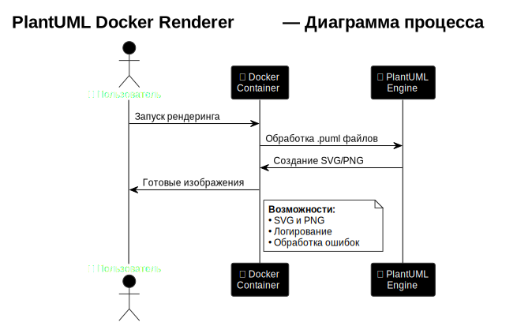
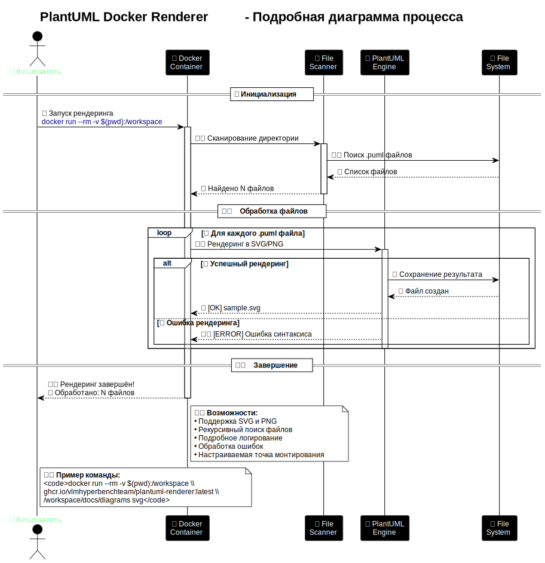

# Руководство по использованию примеров PlantUML Docker Renderer

Эта папка содержит примеры для тестирования и демонстрации работы PlantUML Docker Renderer.

Полная документация проекта доступна в:
- [README.md](../README.md) — основная информация о проекте
- [docs/](../docs/) — подробная документация
- [docs/ghcr-authentication-windows.md](../docs/ghcr-authentication-windows.md) — решение проблемы аутентификации с GitHub Container Registry на Windows

## Содержимое

- `process_simple.puml` — простая диаграмма процесса
- `process_detailed.puml` — подробная диаграмма процесса

## Тестирование

### Локальное тестирование

```bash
# Перейти в папку examples
cd examples

# Рендеринг примера в SVG
export MOUNT_POINT="/workspace"
docker run --rm -v $(pwd):$MOUNT_POINT ghcr.io/vlmhyperbenchteam/plantuml-renderer:latest $MOUNT_POINT svg

# Рендеринг примера в PNG
docker run --rm -v $(pwd):$MOUNT_POINT ghcr.io/vlmhyperbenchteam/plantuml-renderer:latest $MOUNT_POINT png
```

### Ожидаемый результат

После выполнения команд должны появиться файлы:
- `process_simple.svg` — векторное изображение простой диаграммы процесса
- `process_simple.png` — растровое изображение простой диаграммы процесса
- `process_detailed.svg` — векторное изображение подробной диаграммы процесса
- `process_detailed.png` — растровое изображение подробной диаграммы процесса

## Примеры SVG-диаграмм

### Простая диаграмма процесса



[Исходник](process_simple.puml)

---

### Подробная диаграмма процесса



[Исходник](process_detailed.puml) 